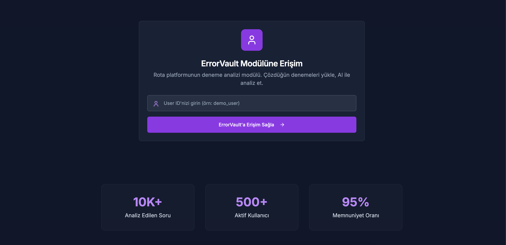

# ErrorVault - AI-Powered Exam Analysis Module

**ErrorVault** is an advanced exam analysis module of the **Rota** platform, designed to revolutionize how students analyze their practice exam performance using artificial intelligence.



## 🎯 Overview

ErrorVault leverages cutting-edge AI technology to provide detailed analysis of practice exam results, helping students identify their strengths and weaknesses across different subjects and question types. The system processes uploaded question images and generates comprehensive performance reports with actionable insights.

## ✨ Key Features

### 📊 **Comprehensive Exam Analysis**
- Upload practice exam images (wrong answers, blank answers)
- AI-powered question analysis using Google Gemini 2.5 Pro
- Automatic subject detection and categorization
- Detailed performance metrics and statistics

### 🤖 **AI-Powered Insights**
- **Question Analysis**: Automatic detection of subject, topic, difficulty level, and question type
- **Error Pattern Recognition**: Identifies common mistake patterns (conceptual, computational, reading, carelessness)
- **Learning Level Assessment**: Evaluates questions based on Bloom's taxonomy
- **Solution Strategy Analysis**: Suggests optimal problem-solving approaches

### 📈 **Performance Tracking**
- Track performance across multiple practice exams
- Monitor improvement over time with detailed charts
- Subject-wise performance breakdown
- Net score calculations and trend analysis

### 📋 **Detailed Reporting**
- AI-generated performance reports
- Subject-specific analysis and recommendations
- Weakness identification and improvement suggestions
- Export capabilities for further analysis

## 🏗️ System Architecture

### **Frontend (Next.js 14)**
- **Dashboard**: Main interface for exam data entry and file uploads
- **Analysis Pages**: Detailed performance analysis and charts
- **Results Viewer**: Comprehensive exam results visualization
- **Landing Page**: User authentication and access control

### **Backend Services**
- **Image Analysis API**: Processes uploaded question images using Gemini AI
- **Report Generation API**: Creates detailed performance reports
- **User Management**: Handles user authentication and data isolation

### **Database (Supabase)**
- **Users**: User account management
- **Exams**: Practice exam records
- **Subjects**: Subject-wise performance data
- **Question Analyses**: Detailed AI analysis results
- **Exam Images**: Uploaded question image storage

## 🔧 Technical Stack

- **Frontend**: Next.js 14, React, TypeScript, Tailwind CSS
- **UI Components**: Shadcn/ui, Lucide Icons
- **Backend**: Next.js API Routes
- **Database**: Supabase (PostgreSQL)
- **AI/ML**: Google Gemini 2.5 Pro API
- **File Storage**: Supabase Storage
- **Authentication**: User ID-based system

## 📚 Supported Exam Types

### **TYT (Basic Proficiency Test)**
- **Turkish**: Grammar, comprehension, literature
- **Mathematics**: Algebra, geometry, statistics
- **Science**: Physics, chemistry, biology
- **Social Studies**: History, geography, philosophy, religion

### **AYT (Field Proficiency Test)**
- Mathematics (Advanced)
- Science (Physics, Chemistry, Biology)
- Social Studies (History, Geography, Literature)
- Language (Turkish Literature, Foreign Language)

## 🚀 Getting Started

### Prerequisites
```bash
Node.js 18+ 
npm or yarn
Supabase account
Google Gemini API key
```

### Installation

1. **Clone the repository**
```bash
git clone https://github.com/your-username/error_vault.git
cd error_vault
```

2. **Install dependencies**
```bash
npm install
```

3. **Environment Setup**
Create a `.env.local` file:
```env
NEXT_PUBLIC_SUPABASE_URL=your_supabase_url
NEXT_PUBLIC_SUPABASE_ANON_KEY=your_supabase_anon_key
GEMINI_API_KEY=your_gemini_api_key
```

4. **Database Setup**
Run the provided SQL migrations in your Supabase dashboard:
```bash
# Create tables
psql -f create-emails-table.sql
psql -f add-total-net-score.sql
```

5. **Start Development Server**
```bash
npm run dev
```

Visit `http://localhost:3000` to access the application.

## 📖 Usage Guide

### 1. **User Access**
- Enter your User ID on the landing page
- System validates user credentials and redirects to dashboard

### 2. **Exam Data Entry**
- Select exam type (TYT/AYT)
- Enter exam date and name
- Input subject-wise scores (correct, wrong, blank)
- Upload question images for analysis

### 3. **AI Analysis**
- System automatically analyzes uploaded images
- Extracts question content and metadata
- Categorizes by subject, difficulty, and error type
- Stores detailed analysis in database

### 4. **Performance Review**
- View comprehensive exam results
- Analyze performance trends over time
- Generate AI-powered performance reports
- Export data for further analysis

## 🎨 User Interface

### **Dashboard**
- Clean, intuitive exam data entry interface
- Real-time validation and feedback
- Progress tracking during analysis
- Responsive design for all devices

### **Analysis Pages**
- Interactive charts and visualizations
- Subject-wise performance breakdown
- Error pattern analysis
- Improvement recommendations

### **Results Viewer**
- Comprehensive exam history
- Detailed question analysis
- Performance comparison tools
- Export and sharing capabilities

## 🔒 Security & Privacy

- **User Isolation**: Each user's data is completely isolated
- **Secure Storage**: All images and data stored securely in Supabase
- **API Security**: Rate limiting and input validation
- **Privacy First**: No personal data collection beyond User ID

## 🤝 Contributing

We welcome contributions! Please follow these steps:

1. Fork the repository
2. Create a feature branch (`git checkout -b feature/amazing-feature`)
3. Commit your changes (`git commit -m 'Add amazing feature'`)
4. Push to the branch (`git push origin feature/amazing-feature`)
5. Open a Pull Request

## 🆘 Support

For support and questions:
- Create an issue on GitHub
- Contact the development team
- Check the documentation wiki

---

**ErrorVault** is part of the **Rota** ecosystem - revolutionizing exam preparation through AI-powered analysis and insights.

Made with ❤️ for students preparing for university entrance exams.